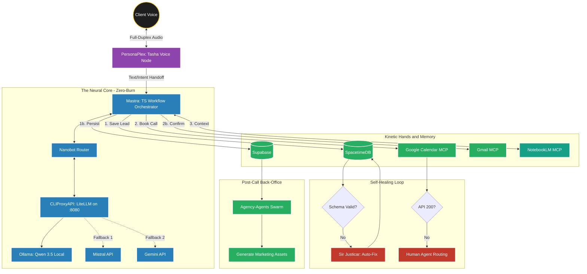

# Tasha System Architecture // Zero-Burn Lattice

## Stack Overview

| Layer | Component | Role |
|---|---|---|
| Voice I/O | PersonaPlex + Web Speech API | Full-duplex audio, barge-in support |
| Neural Core | CLIProxyAPI (LiteLLM) | Free inference gateway on localhost:8080 |
| LLM Cascade | Ollama (Qwen 3.5) -> Mistral -> Gemini | Zero-cost with cloud fallback |
| Orchestrator | Mastra (TypeScript) | Workflow state machine + tool calling |
| Router | Nanobot-Custom Pattern | Multi-model routing + anti-hallucination |
| Database | SpacetimeDB + Supabase | In-memory speed + cloud persistence |
| Memory | NotebookLM MCP | Long-term company context retrieval |
| Back-Office | Agency-Agents | Post-call lead processing swarm |
| Calendar | Google Calendar MCP | Real calendar event creation |
| Email | Gmail MCP | Confirmation email dispatch |

## Data Flow Diagram



## LLM Cascade (Zero-Cost Priority)

```
Request -> CLIProxyAPI (:8080)
  |-> Ollama/Qwen 3.5 4B (local, free, ~200ms)
  |-> Mistral Small (cloud, free tier)
  |-> Gemini 2.0 Flash (cloud, free tier)
```

## Key Endpoints

| Endpoint | Purpose |
|---|---|
| `localhost:8080/v1/chat/completions` | CLIProxyAPI (LiteLLM) |
| `localhost:11434/v1` | Ollama direct |
| `/api/tasha/chat` | Tasha orchestrator |
| `/api/ai/proxy` | Client-side LLM proxy |
| `/api/receptionist/lead` | Lead capture |
| `/api/receptionist/schedule` | Scheduling queue |

## Starting the Stack

```bash
# 1. Start CLIProxyAPI (Ollama + LiteLLM)
./infra/litellm/start.sh    # or start.bat on Windows

# 2. Start Next.js
npm run dev

# 3. Visit /onboarding to talk to Tasha
```
